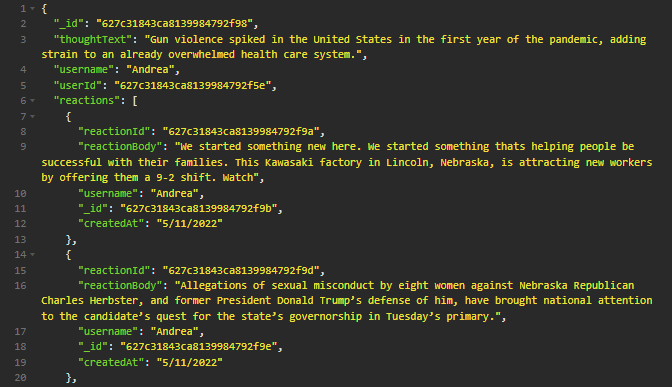

# Rippin_Penny_for_Your_Thoughts_Social_Media_Site
The is a student project toy database management system modeling a social media site back end.

## Installation  
1. Open the resident folder in an integrated terminal.
2. Install depenencies with `npm install`.
3. Populate the database with mock data using `npm run seed`.
4. Start the database with `npm run start`.
## Routes

---- | -------------------- | -------------------   
GET  | `/api/users`         | Returns all users.
---- | -------------------- | -------------------   
GET  | `/api/users/:userId` | Returns a single user with userId.
---- | -------------------- | -------------------   
