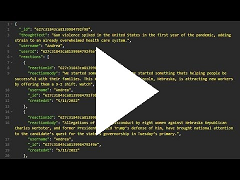

# Rippin_Penny_for_Your_Thoughts_Social_Media_Site
The is a student project toy database management system modeling a social media site back end.

## Video Demonstration   
  

## Installation  
1. Open the resident folder in an integrated terminal.
2. Install depenencies with `npm install`.
3. Populate the database with mock data using `npm run seed`.
4. Start the database with `npm run start`.

## Routes  
Method       | Subdirectory Route                             | Results                    |
------------:| ---------------------------------------------- | -------------------   
GET          | `/api/users`                                   | Returns all users.
GET          | `/api/users/:userId`                           | Returns a single user with userId.
POST         | `/api/users`                                   | Creates the user encoded in the request body.
PUT          | `/api/users/:userId`                           | Modifies the user with the userId with information encoded in the request body.
DELETE       | `/api/users/:userId`                           | Deletes a single user with the userId.
POST         | `/api/users/:userId/friends`                   | Creates the friend encoded in the request body.
DELETE       | `/api/users/:thoughtId/reaction/:friendId`     | Deletes a single friend with friendId.
GET          | `/api/thought`                                 | Returns all thoughts.
GET          | `/api/thought/:thoughtId`                      | Returns a single thought with thoughtId.
POST         | `/api/thought   `                              | Creates the thought encoded in the request body.
PUT          | `/api/thought/:thoughtId`                      | Modifies the thought with the thoughtId with information encoded in the request body.
DELETE       | `/api/thought/:thoughtId`                      | Deletes a single thought with thoughtId.
POST         | `/api/thought/:thoughtId/reaction`             | Creates the reaction encoded in the request body.
DELETE       | `/api/thought/:thoughtId/reaction/:reactionId` | Deletes a single reaction with reactionId.

## Schema  

## MIT License  

Copyright 2022 Matthew J. Tanner

Permission is hereby granted, free of charge, to any person obtaining a copy of this software and associated documentation files (the "Software"), to deal in the Software without restriction, including without limitation the rights to use, copy, modify, merge, publish, distribute, sublicense, and/or sell copies of the Software, and to permit persons to whom the Software is furnished to do so, subject to the following conditions:

The above copyright notice and this permission notice shall be included in all copies or substantial portions of the Software.

THE SOFTWARE IS PROVIDED "AS IS", WITHOUT WARRANTY OF ANY KIND, EXPRESS OR IMPLIED, INCLUDING BUT NOT LIMITED TO THE WARRANTIES OF MERCHANTABILITY, FITNESS FOR A PARTICULAR PURPOSE AND NONINFRINGEMENT. IN NO EVENT SHALL THE AUTHORS OR COPYRIGHT HOLDERS BE LIABLE FOR ANY CLAIM, DAMAGES OR OTHER LIABILITY, WHETHER IN AN ACTION OF CONTRACT, TORT OR OTHERWISE, ARISING FROM, OUT OF OR IN CONNECTION WITH THE SOFTWARE OR THE USE OR OTHER DEALINGS IN THE SOFTWARE.

